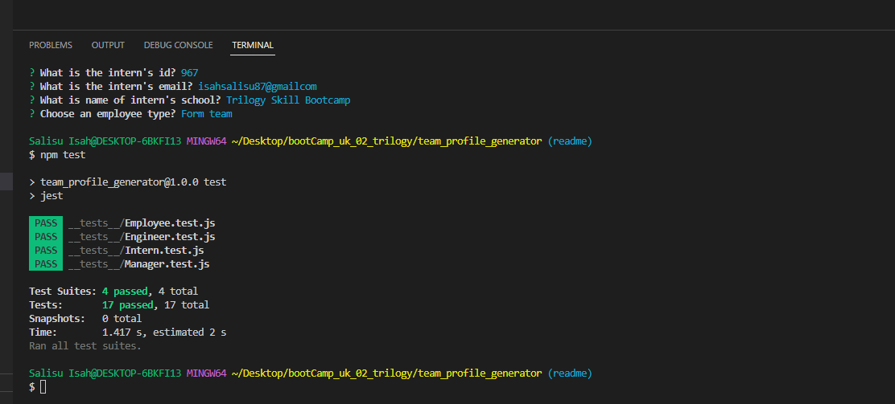
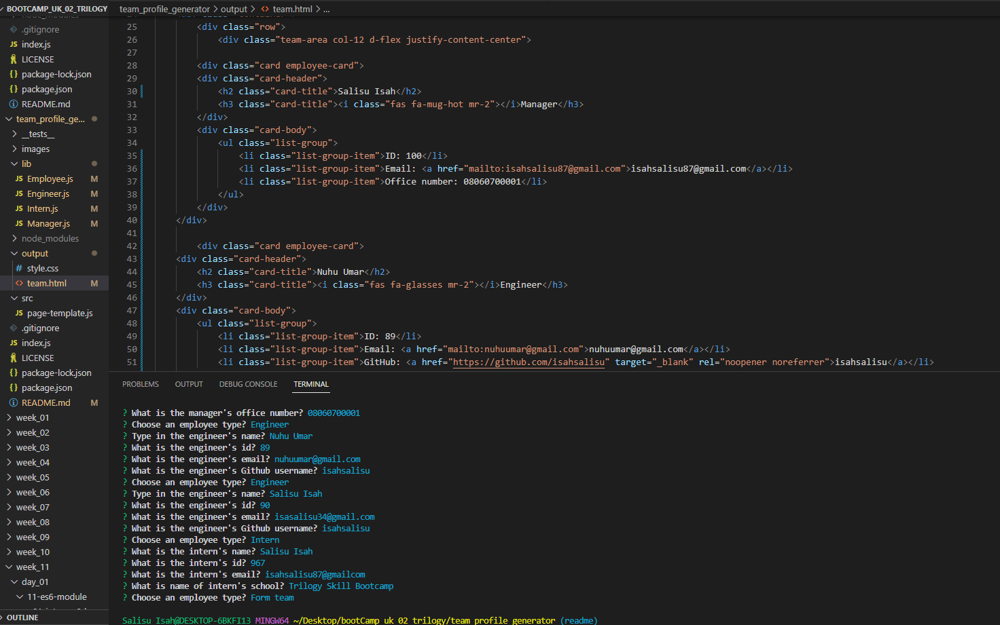
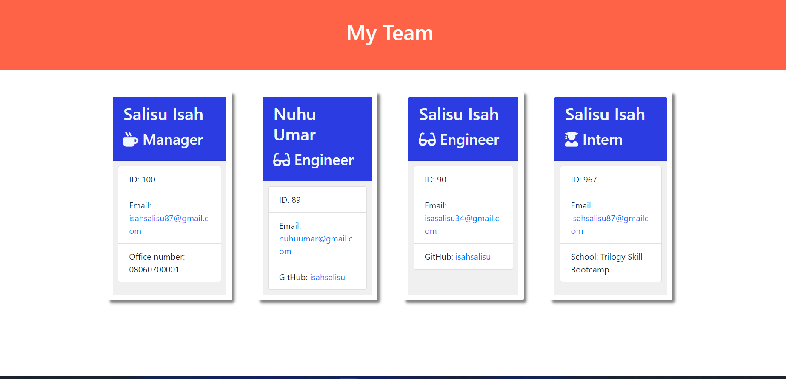

#  team_profile_generator

This is a Node.js command-line application that generates an HTML webpage displaying summaries of team members. It uses inquirer to gather information about the development team members and Jest for running unit tests. The application is invoked by using the following command:

````
node index.js
````

## User Story
```md
As a manager, I want to generate a webpage that displays my team's basic info so I can have quick access to their emails and GitHub profiles.
````

## Navigation

* [Output](#output)
* [Usage](#usage)
* [Functionality](#functionality)
* [Credits](#credits)
* [License](#license)

## Functionality

The application prompts the user to enter the team manager's information:

* Name
* Employee ID
* Email address
* Office number

Then, the user is presented with a menu to add an engineer or an intern or to finish building the team.

* When adding an engineer, the user is prompted to enter:

   * Engineer's Name
   * ID
   * Email
   * GitHub username

* When adding an intern, the user is prompted to enter:

   * Intern’s name
   * ID
   * Email
   * School

When the user finishes building the team, the application exits and the HTML is generated.

## Output
```
The generated HTML file is written to a file named team.html in the output folder and has the appearance and functionality as shown in the mock-up image. Feel free to add your own styling.
```

## usage

Attached is the screenshoot, video for walkthrough demostration of the functionality and the test result.
https://1drv.ms/v/s!AnqK_lD30t_EgQmsN96_36ruSPTt








## Classes

The application uses classes for each team member provided:

* Employee (Parent class) with properties:

   * `name`
   * `id`
   * `email` 

     and methods:

   * `getName()`
   * `getId()`
   * `getEmail()`
   * `getRole()`

* Manager extends Employee with additional properties:
  * officeNumber

* Engineer extends Employee with additional properties:

* `github`

*Intern extends Employee with additional properties:
   * `school`

## Credits
- Inquirer: https://www.npmjs.com/package/inquirer
- Jest: https://www.npmjs.com/package/jest
- NodeJS: https://nodejs.org/en/
- Bootstrap: https://getbootstrap.com/
- Trilogy Education Services, LLC: https://www.trilogyed.com/ 


## License


This project is licensed under the MIT License.


    
